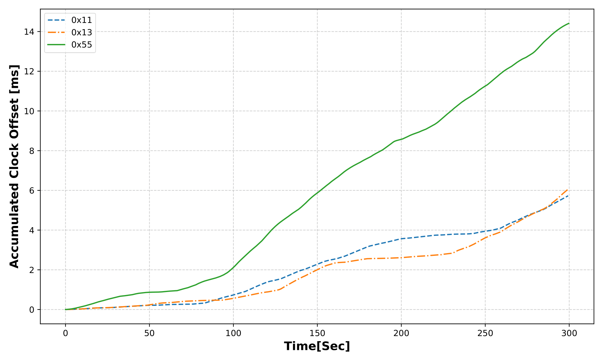
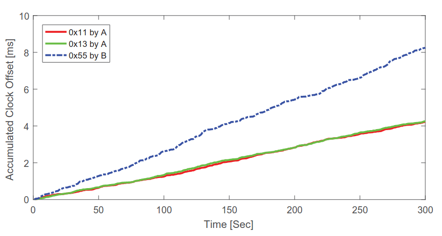
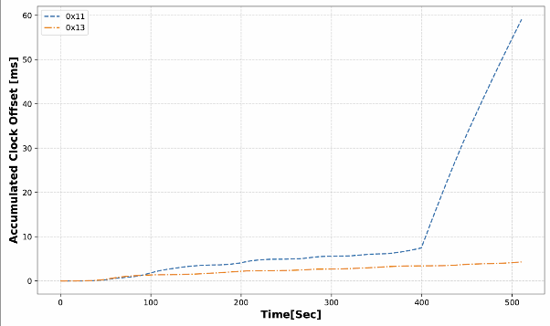
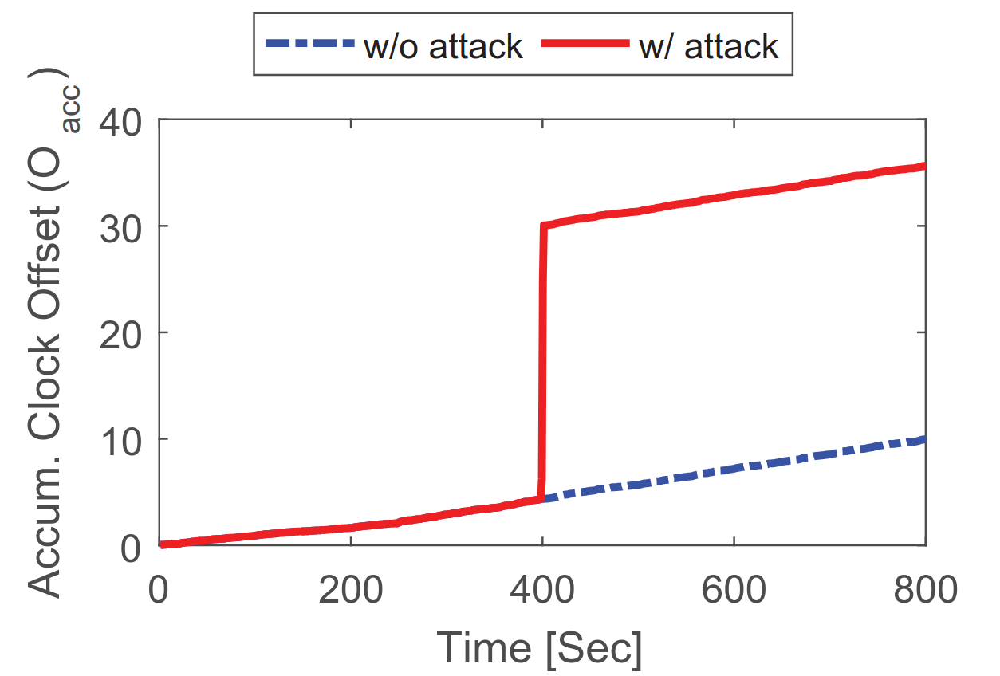

> [!NOTE] 
> The code for these projects may not be the best or the cleanest, as it was written as group project and sometimes in an experimental way.
> Some aspects could definitely be improved and optimized.
# CAN-SkewIDS

CAN-SkewIDS is an implementation of the proof-of-concept (PoC) described in the referenced paper. It serves as an *Intrusion Detection System (IDS)* for the *Controller Area Network (CAN)* protocol, is designed to detect malicious activity by analyzing clock skew to fingerprint *Electronic Control Units (ECUs)*.   The approach is based on the model presented in the paper, referred in their work as a **Clock-based Intrusion Detection System (CIDS)**.

### Reference 

[Fingerprinting Electronic Control Units for Vehicle Intrusion Detection](https://www.usenix.org/system/files/conference/usenixsecurity16/sec16_paper_cho.pdf)

## Experiments & Results

> [!WARNING]  
> Since the tests are performed on one physical device, thus with the same (or extremely similar) quartz clock, we felt the need to introduce an artificial clock skew to our custom CAN device implementations, which adds clock drift to each of the virtual can bus devices that are transmitting messages. 

### Experiment 1: CIDS stability

This experiment is designed to test the overall stability of the CIDS, by having just two devices running on the CAN bus. This experiment is aimed at measuring how stable the algorithm is in regards to False Positives in a perfect scenario.


| Message Count | Period | Skew per Period | False Positives | % Correctly Classified Messages |
|---------------|--------|------------------|------------------|-------------------------------|
| 1000          | 2s     | 10ms             | 3                | 99.7%                         |

 It is worth noting that 1 to 2 False Positives occur very early in the lifespan of the CIDS. This is most likely because of the lack of refined skew data collected at the very beginning of the algorithm (usually up to 5 skew estimations are done, which may produce a larger error).

### Experiment 2: Accumulated Clock Offset *(from the paper)*


This experiment is designed to demonstrate that all the derived accumulated clock offsets were found to be linear in time, furthermore demonstrating that messages sent from the same device have the same constant clock skew and can be used to fingerprint the transmitter ECUs.

|  |  |
|----------------------------------|----------------------------------|
| *Figure 1: Our Results*                       | *Figure 2: Paper Results*                       |

As it can be seen, the messages sent from a device with the same clock skew, but different arbitration Ids correlate, are almost linear.

### Experiment 3: Fabrication Attack Detection *(from the paper)*

The goal of this experiment is to use the accumulated clock skews—previously gathered for ECU fingerprinting—to calculate the deviation of incoming messages. By comparing these deviations, the system can detect intrusions.

|  |  |
|----------------------------------|----------------------------------|
| *Figure 3: Our Results*                       | *Figure 4: Paper Results*                       |

The experiment resulting graph shows a massive increase in accumulated clock offset values once a fabricated message is sent from another device. Thus indicating an intrusion.

## Set Up

All packages required are in `requirements.txt`. 

To run: 
```python
pip install -r requirements.txt
python run main.py
```

---
#### Authors
```
Tautvydas Jackevičius
Giovanni Menon
Ugnius Petryla
```